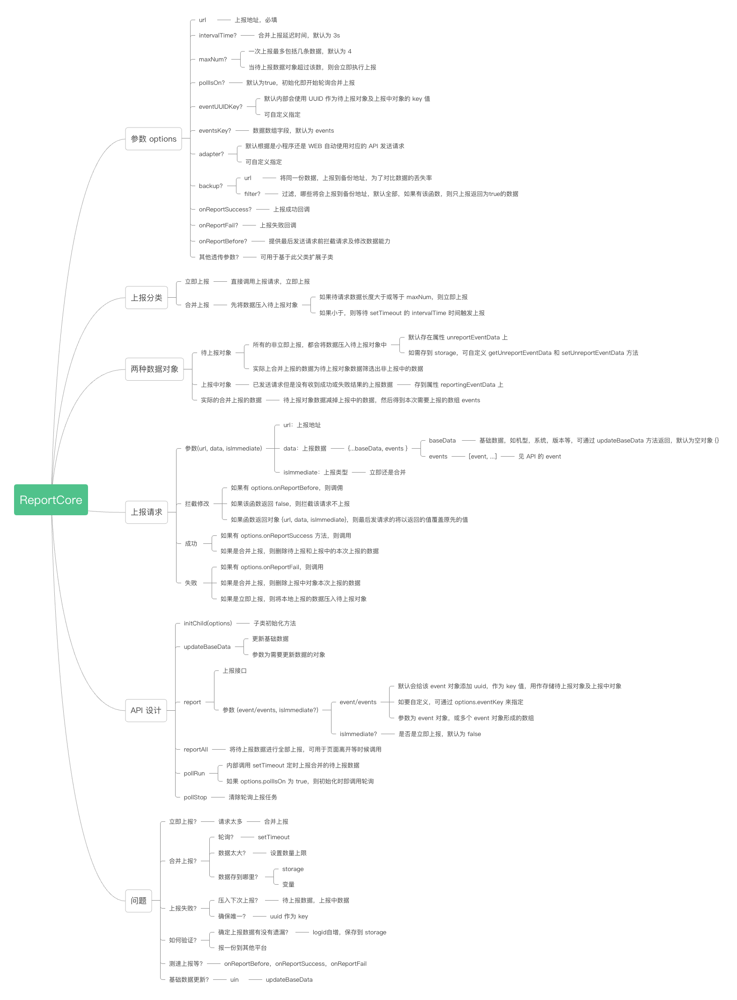

# ReportCore

数据上报基础库。整体设计思想见最后的脑图。

## 功能

- 支持立即上报及合并上报两种；
- 支持合并上报轮询的开启及停止；
- 支持自定义合并上报的最大数据量，防止一次上报数据太大，导致可能失败；
- 支持上报拦截及修改；
- 支持最后将还未上报的数据，一次性全部发送；
- 支持将同一份数据上报到备份地址，为了查证上报的丢失率；
- 支持上报失败后，会自动将失败的数据压入待上报数据，等待下次合并上报的重新上报；
- 支持自定义发送请求适配器，默认自动判断使用 `wx.request` 还是 `XMLHttpRequest` 进行上报。

## 使用

如果你的上报比较简单，可以直接通过实例化形式使用。反之，如果比较复杂，那就可以基于此类进行扩展实现更多功能，下面以实例化为例简单说明如何使用：

```js
// reporter.ts
// 实例化
const reporter = new ReportCore({
  url: 'xxx',
  // maxNum: 4, // 一次上报最多包括几条数据，当未上报数据大于该值时，会自动触发上报，且上报时会以此为分割，防止一次上报数据过大造成失败
  // intervalTime: 3000, // setTimeout 执行上报的间隔时间，如果为 0，所有上报将会变成立即上报
  // pollIsOn: true, // 默认初始化即开始轮询合并上报
  // eventKey: 'uuid', // 待上报数据对象和上报中数据对象的唯一 key，默认会自动生成 uuid 作为 key 值，如果指定该值，则以上报数据中该值为 key
  // adapter: 'xxx', // 默认根据是小程序还是 WEB 自动使用对应的 API 发送请求
  // backup: {
  //   // 同一份数据的备份上报
  //   url: 'xxx',
  //   filter: (events: IEvent[]) => {
  //     //  return false 则不上报
  //     console.log(events);
  //     return false;
  //   },
  // },
  // onReportSuccess: (events: IEvent[]) => {
  //   console.log('success', events);
  // },
  // onReportFail: (err, events: IEvent[]) => {
  //   console.log('fail', err, events);
  // },
  // onReportBefore: (url: string, data: IRequestData, isImmediate: boolean) => {
  //   // 如果返回为 false，则拦截该请求不上报
  //   // 如果返回对象 {url, data, isImmediate}，则最后发送请求的参数为该对象的值
  //   console.log(url, data, isImmediate);
  // }
});

// 更新基础数据
const baseData = {
  appId: 'xxx',
  appVersion: 'xxx',
  platform: 'xxx',
};

reporter.updateBaseData(baseData);

// 自定义待上报数据对象的存储于读取
reporter.setUnreportEventData = () => {
  wx.setStorage({
    key: 'unreportEventData',
    data,
  });
};
reporter.getUnreportEventData = (data) => {
  return wx.getStorageSync('unreportEventData');
};

export default reporter;
```

2、调用

```js
import reporter from './reporter';

const fakeEvent1 = {
  eventTime: Date.now.toString(),
  type: 'click',
  value: 'xxx',
};

const fakeEvent2 = {
  eventTime: Date.now.toString(),
  type: 'view',
  value: 'xxx',
};

// 立即上报
reporter.report(fakeEvent1, true);

// 合并上报
reporter.report(fakeEvent1);

// 多条数据上报
reporter.report([fakeEvent1, fakeEvent2]);

// 用于最后页面离开等情况的，将未上报的数据进行上报
reporter.reportAll();
```

## 上报数据结构说明

```js
export interface IRequestData {
  events: IEvent[]; // 需要上报的数据数组
  [k: string]: any; // baseData，如机型，版本号等
}

export interface IEvent {
  [k: string]: any;
}
```

## 合并上报说明

### 合并上报触发条件

- 待上报数据超过 maxNum（默认为 4），执行上报。同时如果一次上报数据超过 maxNum，将进行切割上报。
- 轮询每隔 intervalTime（默认为 3s）， 执行上报。

### 合并上报涉及的数据

- 待上报数据对象（unreportEventData）：默认存储在 `this.unreportEventData` 属性中，支持自定义存储位置，如 storage，见下面例子。
- 上报中数据对象（reportingEventData）：合并上报中已发出请求但是没有收到失败或成功的正在上报中的数据。
- 本次合并上报的将要发送的数据数组（events）：循环遍历待上报数据对象中的数据，如果该数据不在上报中的，则将该数据 push 进将要发送的数据数组中。

## 整体设计脑图


